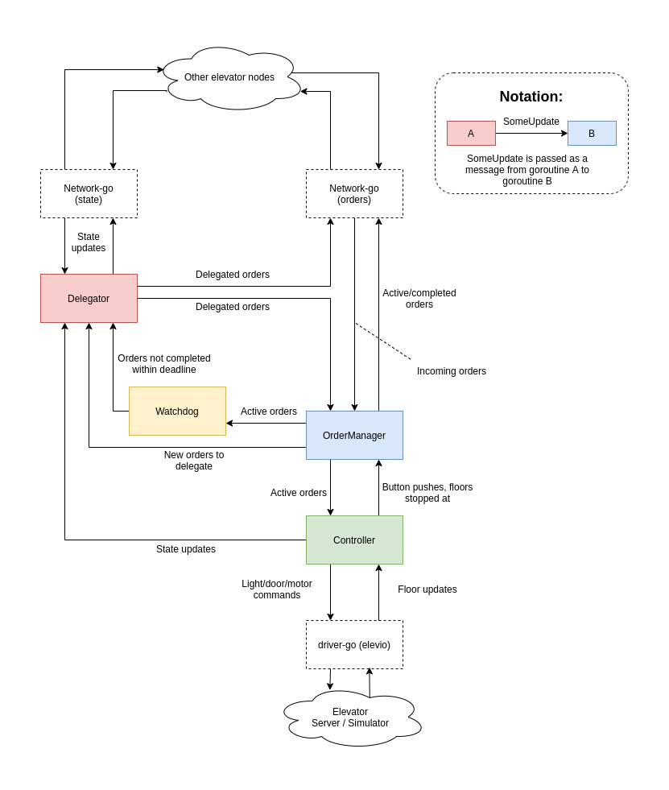

# Go-heisen
Elevator Project for TTK4145 Real Time Programming at NTNU

## Design decisions:
- Random Unique IDs for every order:
    - Makes it possible to differentiate a new order from the one that was completed a minute ago
- Peer-to-peer: 
    - Every node may assign an order to any node
    - Every node stores all orders for all nodes
    - Every node regularly broadcasts all the orders for all nodes it believes are active
        - If a node receives an active order it knows is completed, it broadcasts the completed order so the other nodes may clear it
        - This ensures that the elevators quickly converge to a common belief state, even through restarts and disconnects/reconnects
    - Any node may clear a hall order if it has been finished, regardless of if it was the intended executor
- Order Delegation
    - The nodes regularly broadcast their states
    - The node that receives a button push delegates the order to the best recipent, given the stored states of the other nodes
- Redundancy
    - If an order is for any reason not completed within the deadline (40 seconds), every node redelegates the order to a new node
        - Remember that all the equivalent orders are cleared if one is completed

## Modules

### Concurrent goroutines
- `OrderProcessor`:
  - Keeps track of all orders in all nodes
  - Updates it's `OrderRepository` with incoming orders from other nodes
    - Sends all the active orders to the `Controller` if changes are made
  - Creates and broadcasts orders from button pushes if no equivalent orders exist
  - Clears all equivalent orders when arriving at a floor, broadcasts the completed orders to the other nodes
  - Regularly rebroadcasts all active orders
  - Regularly provides `Watchdog` with all the active orders, s.t. it may redelegate the ones not completed within the deadline
- `Controller`:
  - Interfaces with `ElevatorServer`, executes the active orders that belong to the node. Heavily based on [elev_algo](https://github.com/TTK4145/Project-resources/tree/master/elev_algo) from the [`ProjectResources`](https://github.com/TTK4145/Project-resources) repository
  - Controls the motor, lights, door, and receives updates of new floors
  - Informs `OrderProcessor` when a button is pushed or a floor is stopped at, does not make decisions to create/complete orders itself
  - Informs `Delegator` when the state has changed
- `Delegator`:
  - Delegates new orders provided by `OrderProcessor`
  - Orders are delegated to the node with the lowest `Cost`
  - Redelegates orders to a new recipent if provided by `Watchdog` 
- `Watchdog`:
  - Checks that active orders provided by `OrderProcessor` are completed within the deadline
    - Sends orders to `Delegator` to be redelegated if they are too old
### Other modules
- `elevator`:
  - Definitions of orders, elevator state, as well as types for buttons, motor directions etc.
### Libraries used
- `Network-go`
  - Used for broadcasting and receiving elevator state and orders between nodes.
- `driver-go`
  - Used for interfacing with the [`ElevatorServer`](https://github.com/TTK4145/) or [`Simulator`](https://github.com/TTK4145/Simulator-v2)
